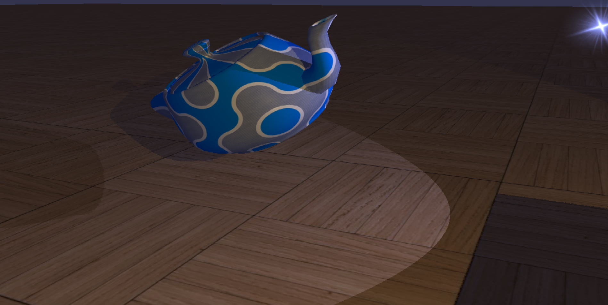
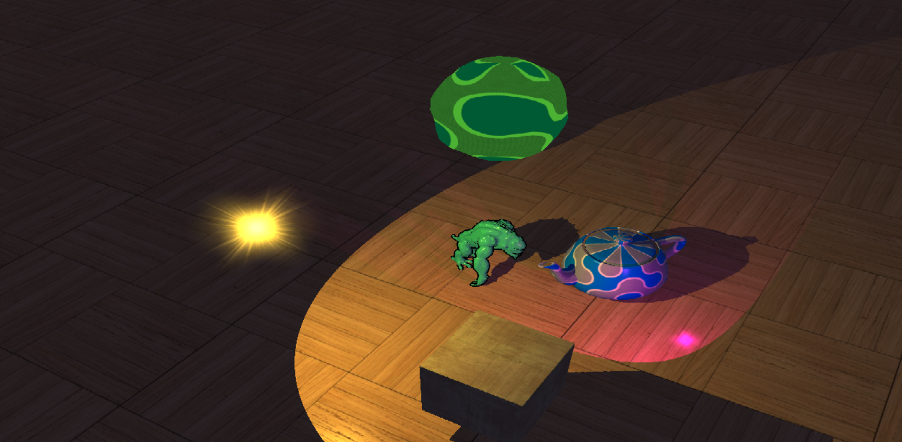
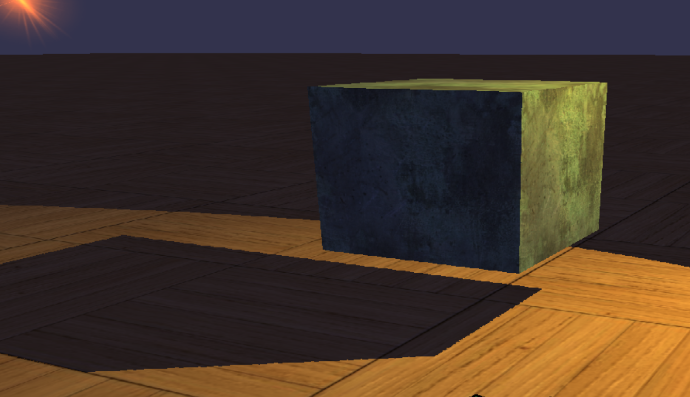
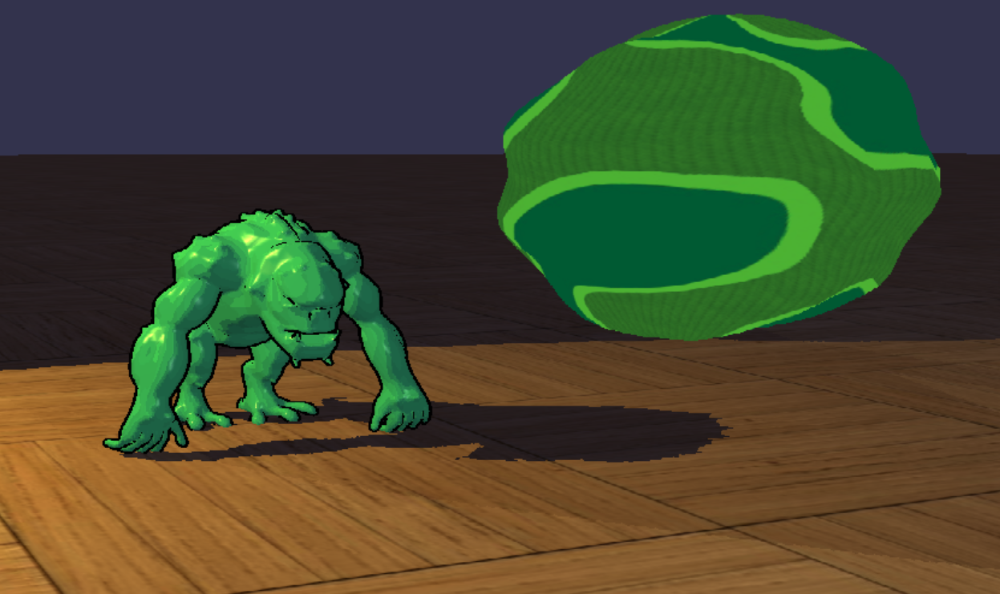

# 3D Models

Kseniia Marchenko
ksumar4enko@gmail.com

## About the project

Real-time 3D rendering application that demonstrates advanced graphics techniques such as shadow mapping, per-pixel lighting, dynamic model control, and special visual effects like wiggling and texture scrolling. 

### Development Tools
- Visual Studio 2022
- С++
- DirectX 11
- HLSL

## Getting Started

### Installation

1. Clone the repository

```
git clone https://github.com/mainex/3d-models
```
2. Open `ShadowMapping.sln` and build the project.
3. Run `ShadowMapping.exe`.

## Usage

The shaders used the following techniques:
- The **shadow mapping** was implemented for all the models.
-	Teapot is **controlled by** Key_I, Key_K, Key_J, Key_L, Key_U, Key_O, Key_Period, Key_Comma.

- **Per-pixel lighting** calculations for two directional lights.
  - 1st light source changes its colour and moving around the scene.
  - 2nd light source periodically fades.

- **Wiggling effect** was implemented by recalculation the wiggle variable in the [`UpdateScene()`](3d-models/Scene.cpp) function. [`Wiggling_vs.hsls`](3d-models/Wiggling_vs.hlsl) is a shader that wiggles the sphere.
- [`Scrolling_ps.hsls`](3d-models/Scrolling_ps.hlsl) is a pixel shader for **scrolling the texture up**.
- The Cube **changing the texture** from stone to wood and back ([`MixingTextures_ps.hlsl`](3d-models/MixingTextures_ps.hlsl)).

- **Cartoon style** of the Troll: [`CellShading_vs.hsls`](3d-models/CellShading_vs.hsls), [`CellShading_ps.hsls`](3d-models/CellShading_ps.hsls), [`CellShadingOutline_ps.hsls`](3d-models/CellShadingOutline_ps.hsls), [`CellShadingOutline_vs.hsls`]((3d-models/CellShadingOutline_vs.hsls)). Also, the Troll casts a shadow.


_More detailed shaders overiew is provided in [Implementaton Report](report.md)._

## Contact

Kseniia Marchenko ksumar4enko@gmail.com - https://t.me/xmarchenko - https://github.com/mainex

Project Link: https://github.com/mainex/3d-models


